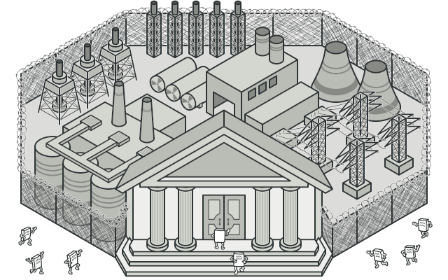
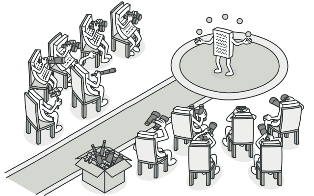

# Design Patterns for TypeScript

Reference: https://refactoring.guru/design-patterns/typescript

# The Catalog of TypeScript

## Group 01 - Creational Patterns

### Pattern 01 - Abstract Factory

Lets you produce families of related objects without specifying their concrete classes.

### Pattern 02 - Builder

Lets you construct complex objects step by step. The pattern allows you to produce different types and representations of an object using the same construction code.

### Pattern 03 - Factory Method

Provides an interface for creating objects in a superclass, but allows subclasses to alter the type of objects that will be created.

### Pattern 04 - Prototype

Lets you copy existing objects without making your code dependent on their classes.

### Pattern 05 - Singleton

Lets you ensure that a class has only one instance, while providing a global access point to this instance.

## Group 02 - Structural Patterns

### Pattern 06 - Adapter

Allows objects with incompatible interfaces to collaborate.

### Pattern 07 - Bridge

Lets you split a large class or a set of closely related classes into two separate hierarchies—abstraction and implementation—which can be developed independently of each other.

### Pattern 08 - Composite

Lets you compose objects into tree structures and then work with these structures as if they were individual objects.

### Pattern 09 - Decorator

Lets you attach new behaviors to objects by placing these objects inside special wrapper objects that contain the behaviors.

### Pattern 10 - Facade

Provides a simplified interface to a library, a framework, or any other complex set of classes.

### Pattern 11 - Flyweight

Lets you fit more objects into the available amount of RAM by sharing common parts of state between multiple objects instead of keeping all of the data in each object.

### Pattern 12 - Proxy

Lets you provide a substitute or placeholder for another object. A proxy controls access to the original object, allowing you to perform something either before or after the request gets through to the original object.

## Group 03 - Behavioral Patterns

### Pattern 13 - Chain of Responsibility 

Lets you pass requests along a chain of handlers. Upon receiving a request, each handler decides either to process the request or to pass it to the next handler in the chain.

### Pattern 14 - Command

Turns a request into a stand-alone object that contains all information about the request. This transformation lets you pass requests as a method arguments, delay or queue a request's execution, and support undoable operations.

### Pattern 15 - Iterator

Lets you traverse elements of a collection without exposing its underlying representation (list, stack, tree, etc.).

### Pattern 16 - Mediator

Lets you reduce chaotic dependencies between objects. The pattern restricts direct communications between the objects and forces them to collaborate only via a mediator object.

### Pattern 17 - Memento

Lets you save and restore the previous state of an object without revealing the details of its implementation.

### Pattern 18 - Observer

Lets you define a subscription mechanism to notify multiple objects about any events that happen to the object they're observing.

### Pattern 19 - State

Lets an object alter its behavior when its internal state changes. It appears as if the object changed its class.

### Pattern 20 - Strategy

Lets you define a family of algorithms, put each of them into a separate class, and make their objects interchangeable.

### Pattern 21 - Template Method

Defines the skeleton of an algorithm in the superclass but lets subclasses override specific steps of the algorithm without changing its structure.

### Pattern 22 - Visitor

Lets you separate algorithms from the objects on which they operate.
